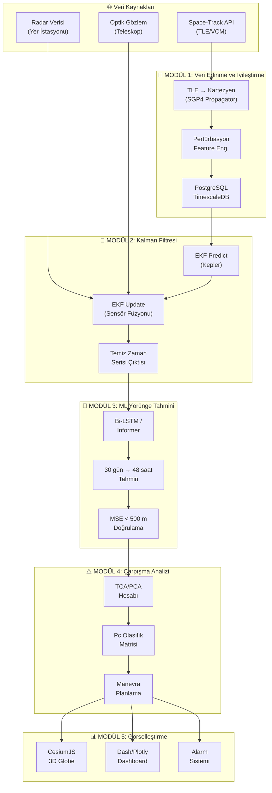

# 🛰️ Yörünge Temizliği: Uzay Çöpü Takip Modeli

> **Proje Odağı:** Uzay Nesnelerinin Yerden Gözlemi ve Takibi  
> **Amaç:** Türk uydularının (TÜRKSAT, İMECE, GÖKTÜRK) yörüngesindeki enkaz ve çöpleri tespit eden, olası çarpışma rotalarını hesaplayan ve manevra önerisi sunan bir makine öğrenmesi tabanlı uzay trafik yönetim sistemi (STM) geliştirmek.  
> **Son Güncelleme:** 2026-03-28

---

## 📋 İçindekiler

1. [Proje Genel Bakış](#1-proje-genel-bakış)
2. [Mimari Diyagram](#2-mimari-diyagram)
3. [Modül 1 — Veri Edinme ve İyileştirme Katmanı](#3-modül-1--veri-edinme-ve-iyileştirme-katmanı)
4. [Modül 2 — Kalman Filtresi (Veri Füzyonu)](#4-modül-2--kalman-filtresi-veri-füzyonu)
5. [Modül 3 — ML ile Yörünge Tahmini](#5-modül-3--ml-ile-yörünge-tahmini)
6. [Modül 4 — Çarpışma Analizi ve Karar Destek](#6-modül-4--çarpışma-analizi-ve-karar-destek)
7. [Modül 5 — Görselleştirme ve Kontrol Paneli](#7-modül-5--görselleştirme-ve-kontrol-paneli)
8. [Teknoloji Yığını](#8-teknoloji-yığını)
9. [Zaman Çizelgesi](#9-zaman-çizelgesi)
10. [Risk Analizi](#10-risk-analizi)

---

## 1. Proje Genel Bakış

### Problem Tanımı

Dünya yörüngesinde **36.000+** kataloglanmış uzay nesnesi bulunmaktadır. Bu nesnelerin büyük çoğunluğu artık işlev görmeyen uydu parçaları, roket gövdeleri ve çarpışma sonucu oluşmuş enkazlardır. Türkiye'nin aktif uyduları (TÜRKSAT serisi, İMECE, GÖKTÜRK) için bu enkaz bulutları ciddi bir çarpışma riski oluşturmaktadır.

### Çözüm Yaklaşımı

```
Ham TLE Verisi → Kartezyen Dönüşüm → Kalman Filtresi → ML Tahmin → Çarpışma Analizi → Manevra Önerisi
```

| Parametre | Hedef |
|---|---|
| Tahmin Penceresi | 48 saat ileri |
| Konum Doğruluğu (MSE) | < 500 m |
| Çarpışma Olasılığı Eşiği | $P_c > 10^{-4}$ |
| Alarm Süresi | Gerçek zamanlı (< 5 sn gecikme) |
| Desteklenen Uydu Sayısı | 10+ (başlangıç) |

---

## 2. Mimari Diyagram



---

## 3. Modül 1 — Veri Edinme ve İyileştirme Katmanı

### 🎯 Amaç
Space-Track API'den ham TLE/VCM verilerini çekerek kullanılabilir Kartezyen koordinatlara dönüştürmek ve pertürbasyon etkilerini feature olarak eklemek.

---

### Checkpoint 1.1 — Space-Track API Entegrasyonu
- [ ] Space-Track hesabı oluştur ve API erişim anahtarlarını al
- [ ] Python `spacetrack` kütüphanesi ile bağlantı kur
- [ ] TLE verilerini otomatik çekme scripti yaz (cron job / scheduler)
- [ ] Rate limiting ve hata yönetimi (retry logic) implementasyonu
- [ ] Ham TLE verilerini `.json` formatında logla

```python
# Örnek: Space-Track API Bağlantısı
from spacetrack import SpaceTrackClient

st = SpaceTrackClient(identity='user@email.com', password='xxxxx')

# TÜRKSAT 5A için TLE çekme
tle_data = st.tle_latest(
    norad_cat_id=[53159],  # TÜRKSAT 5A
    orderby='epoch desc',
    limit=1,
    format='tle'
)
```

> **Başarı Kriteri:** 24 saat boyunca kesintisiz veri çekme, hata oranı < %1

---

### Checkpoint 1.2 — TLE → Kartezyen Koordinat Dönüşümü (SGP4)
- [ ] `sgp4` Python kütüphanesini entegre et
- [ ] TLE → ECI (Earth-Centered Inertial) koordinat dönüşümü
- [ ] ECI → ECEF (Earth-Centered Earth-Fixed) dönüşümü
- [ ] Hız bileşenlerini ($v_x, v_y, v_z$) hesapla
- [ ] Birim testleri yaz (bilinen uydu pozisyonları ile karşılaştır)

```python
# Örnek: SGP4 ile Kartezyen Dönüşüm
from sgp4.api import Satrec, WGS72
from sgp4.api import jday

satellite = Satrec.twoline2rv(tle_line1, tle_line2, WGS72)
jd, fr = jday(2026, 3, 28, 12, 0, 0)
e, r, v = satellite.sgp4(jd, fr)

# r = (x, y, z) km cinsinden konum
# v = (vx, vy, vz) km/s cinsinden hız
```

> **Başarı Kriteri:** Bilinen uydu pozisyonlarıyla karşılaştırma, hata < 1 km

---

### Checkpoint 1.3 — Türk Uydu Kataloğu Veritabanı
- [ ] PostgreSQL + TimescaleDB kurulumu
- [ ] Veritabanı şeması tasarımı (hypertable yapısı)
- [ ] Türk uydu envanteri:

| Uydu Adı | NORAD ID | Yörünge Türü | Durum |
|---|---|---|---|
| TÜRKSAT 5A | 53159 | GEO | Aktif |
| TÜRKSAT 5B | 54234 | GEO | Aktif |
| TÜRKSAT 6A | — | GEO | Planlanan |
| İMECE | 55880 | LEO (680 km) | Aktif |
| GÖKTÜRK-1 | 42898 | LEO (680 km) | Aktif |
| GÖKTÜRK-2 | 39030 | LEO (700 km) | Aktif |

- [ ] Otomatik veri ekleme pipeline'ı (ETL süreci)
- [ ] Veri bütünlüğü kontrolleri ve indeksleme

```sql
-- TimescaleDB Hypertable Yapısı
CREATE TABLE orbital_states (
    time           TIMESTAMPTZ NOT NULL,
    norad_id       INTEGER NOT NULL,
    satellite_name VARCHAR(50),
    x              DOUBLE PRECISION,  -- km
    y              DOUBLE PRECISION,  -- km
    z              DOUBLE PRECISION,  -- km
    vx             DOUBLE PRECISION,  -- km/s
    vy             DOUBLE PRECISION,  -- km/s
    vz             DOUBLE PRECISION,  -- km/s
    j2_effect      DOUBLE PRECISION,
    srp_effect     DOUBLE PRECISION,
    drag_effect    DOUBLE PRECISION,
    data_source    VARCHAR(20),
    PRIMARY KEY (time, norad_id)
);

SELECT create_hypertable('orbital_states', 'time');
```

> **Başarı Kriteri:** Tüm Türk uyduları için 30+ günlük veri biriktirme

---

### Checkpoint 1.4 — Pertürbasyon Feature Mühendisliği
- [ ] **J2 Katsayısı** (Dünya'nın basıklığı):
  - Harmonik katsayı $J_2 = 1.08263 \times 10^{-3}$
  - Yörünge düzlemi kayması hesaplaması (nodal precession)
- [ ] **Güneş Radyasyon Basıncı (SRP)**:
  - Uydu yüzey alanı ve kütle oranı ($A/m$) parametresi
  - Gölge geçişleri (eclipse) modelleme
- [ ] **Atmosferik Sürüklenme (Drag)**:
  - LEO uydular için balistik katsayı ($C_D$) hesabı
  - Atmosfer yoğunluk modeli: NRLMSISE-00 veya JB2008
  - Güneş aktivitesi (F10.7 indeksi) entegrasyonu
- [ ] **Ay ve Güneş Çekimi (Third-Body Effects)**:
  - GEO yörünge uydular için önemli
  - JPL Ephemeris verisi kullanımı
- [ ] Feature normalizasyonu ve ölçeklendirme (StandardScaler)

```python
# Pertürbasyon Feature Vektörü
features = {
    'j2_drift_rate':      calculate_j2_precession(inclination, semi_major),
    'srp_acceleration':   calculate_srp(area_to_mass, solar_flux),
    'drag_acceleration':  calculate_drag(Cd, A_m, rho, velocity),
    'third_body_sun':     calculate_solar_perturbation(sat_pos, sun_pos),
    'third_body_moon':    calculate_lunar_perturbation(sat_pos, moon_pos),
    'solar_activity_f107': get_f107_index(date),
    'geomagnetic_ap':     get_ap_index(date),
}
```

> **Başarı Kriteri:** Feature'lar eklendiğinde tahmin doğruluğunda ≥ %15 iyileşme

---

## 4. Modül 2 — Kalman Filtresi (Veri Füzyonu)

### 🎯 Amaç
Farklı sensörlerden gelen gürültülü ölçümleri birleştirip, temiz ve güvenilir bir durum tahmini üretmek.

---

### Checkpoint 2.1 — Durum Uzayı Modeli Tanımlama
- [ ] Durum vektörünü ($\mathbf{x}$) tanımla:

$$\mathbf{x} = [x, y, z, v_x, v_y, v_z, C_D, C_{SRP}]^T$$

- [ ] Durum geçiş fonksiyonu $f(\mathbf{x})$: Kepler denklemleri + pertürbasyonlar
- [ ] Gözlem fonksiyonu $h(\mathbf{x})$: Kartezyen → Radar ölçüm dönüşümü
- [ ] Jacobian matrisleri ($F$ ve $H$) analitik türetme
- [ ] Başlangıç kovaryansi ($P_0$) tanımlama

> **Başarı Kriteri:** Durum uzayı modelinin birim testlerden geçmesi

---

### Checkpoint 2.2 — Genişletilmiş Kalman Filtresi (EKF) İmplementasyonu
- [ ] EKF predict adımı:

$$\hat{\mathbf{x}}_{k|k-1} = f(\hat{\mathbf{x}}_{k-1|k-1})$$
$$P_{k|k-1} = F_k P_{k-1|k-1} F_k^T + Q_k$$

- [ ] EKF update adımı:

$$K_k = P_{k|k-1} H_k^T (H_k P_{k|k-1} H_k^T + R_k)^{-1}$$
$$\hat{\mathbf{x}}_{k|k} = \hat{\mathbf{x}}_{k|k-1} + K_k (z_k - h(\hat{\mathbf{x}}_{k|k-1}))$$
$$P_{k|k} = (I - K_k H_k) P_{k|k-1}$$

- [ ] Numerik kararlılık kontrolleri (Joseph form covariance update)
- [ ] $Q$ ve $R$ matris hiperparametre tuning
- [ ] Filtrelenmiş çıktıyı veritabanına yaz

```python
class ExtendedKalmanFilter:
    def __init__(self, dim_state=8, dim_obs=6):
        self.x = np.zeros(dim_state)          # Durum vektörü
        self.P = np.eye(dim_state) * 1e4      # Kovaryans matrisi
        self.Q = np.eye(dim_state) * 1e-6     # Süreç gürültüsü
        self.R = np.eye(dim_obs) * 1e-2       # Ölçüm gürültüsü

    def predict(self, dt):
        self.x = self._state_transition(self.x, dt)
        F = self._jacobian_F(self.x, dt)
        self.P = F @ self.P @ F.T + self.Q

    def update(self, z):
        H = self._jacobian_H(self.x)
        y = z - self._observation_model(self.x)  # inovasyon
        S = H @ self.P @ H.T + self.R
        K = self.P @ H.T @ np.linalg.inv(S)      # Kalman kazancı
        self.x = self.x + K @ y
        I_KH = np.eye(len(self.x)) - K @ H
        self.P = I_KH @ self.P @ I_KH.T + K @ self.R @ K.T  # Joseph form
```

> **Başarı Kriteri:** Filtrelenmiş verinin ham veriye göre gürültüde ≥ %60 azalma

---

### Checkpoint 2.3 — Unscented Kalman Filtresi (UKF) Alternatifi
- [ ] Sigma noktaları hesaplama
- [ ] UKF predict ve update adımları
- [ ] EKF vs UKF performans karşılaştırması
- [ ] Yüksek eksentrikli yörüngeler için UKF tercih edilecek

> **Başarı Kriteri:** UKF'nin yüksek eksentrikli yörüngelerde EKF'den daha iyi performans göstermesi

---

### Checkpoint 2.4 — Çoklu Sensör Füzyonu
- [ ] Radar verisi entegrasyonu (range, azimuth, elevation)
- [ ] Optik teleskop verisi entegrasyonu (right ascension, declination)
- [ ] TLE verisi entegrasyonu (ek kaynak)
- [ ] Sensör güvenilirlik ağırlıklandırma
- [ ] Veri kalitesi skoru hesaplama

| Sensör Tipi | Ölçüm | Tipik Hata | Ağırlık |
|---|---|---|---|
| Radar (S-band) | Range, Az, El | ±50 m, ±0.01° | Yüksek |
| Optik Teleskop | RA, Dec | ±1 arcsec | Orta |
| TLE (Space-Track) | Orbital Elements | ±1 km | Düşük |

> **Başarı Kriteri:** Fusion çıktısının tek sensöre göre ≥ %30 daha doğru olması

---

## 5. Modül 3 — ML ile Yörünge Tahmini

### 🎯 Amaç
Kalman filtresinden gelen temiz zaman serisi verisini kullanarak 48 saat ileriye yörünge tahmini yapmak.

---

### Checkpoint 3.1 — Veri Ön İşleme ve Windowing
- [ ] Zaman serisi windowing fonksiyonu:
  - Pencere boyutu: 30 gün (girdi)
  - Tahmin ufku: 48 saat (çıktı)
  - Kaydırma adımı: 1 saat
- [ ] Train/Validation/Test bölme: %70 / %15 / %15
- [ ] Feature normalizasyonu (MinMaxScaler veya StandardScaler)
- [ ] Veri artırma (data augmentation): Gürültü enjeksiyonu, yörünge döndürme

```python
def create_windows(data, input_days=30, prediction_hours=48, stride_hours=1):
    """
    Zaman serisi verisini ML modeli için pencereler.

    Args:
        data: (N, features) numpy array — Kalman çıktısı
        input_days: Girdi penceresi (gün)
        prediction_hours: Tahmin ufku (saat)
        stride_hours: Kaydırma adımı (saat)

    Returns:
        X: (samples, input_steps, features)
        y: (samples, output_steps, 3)  # x, y, z
    """
    input_steps = input_days * 24 * 60    # dakika bazında
    output_steps = prediction_hours * 60
    stride = stride_hours * 60

    X, y = [], []
    for i in range(0, len(data) - input_steps - output_steps, stride):
        X.append(data[i:i+input_steps])
        y.append(data[i+input_steps:i+input_steps+output_steps, :3])

    return np.array(X), np.array(y)
```

> **Başarı Kriteri:** En az 10.000 eğitim penceresi oluşturma

---

### Checkpoint 3.2 — Bi-LSTM Model Mimarisi
- [ ] Model tasarımı:

```
Input (30 gün × 10 features)
    │
    ▼
Bi-LSTM Layer 1 (256 units, return_sequences=True)
    │
    ▼
Dropout (0.2)
    │
    ▼
Bi-LSTM Layer 2 (128 units, return_sequences=True)
    │
    ▼
Attention Layer (Self-Attention)
    │
    ▼
Bi-LSTM Layer 3 (64 units)
    │
    ▼
Dense (128, activation='relu')
    │
    ▼
Dense (48 saat × 3 koordinat)
    │
    ▼
Reshape → Output (48h × 3)
```

- [ ] Attention mekanizması ekleme (yörünge periyodunu öğrenmesi için)
- [ ] Residual bağlantılar
- [ ] Fizik-bilgili kayıp fonksiyonu (Physics-Informed Loss):

$$\mathcal{L} = \mathcal{L}_{MSE} + \lambda_1 \mathcal{L}_{energy} + \lambda_2 \mathcal{L}_{kepler}$$

```python
import torch
import torch.nn as nn

class BiLSTMOrbitPredictor(nn.Module):
    def __init__(self, input_features=10, hidden_size=256,
                 num_layers=3, output_hours=48, dropout=0.2):
        super().__init__()

        self.lstm = nn.LSTM(
            input_size=input_features,
            hidden_size=hidden_size,
            num_layers=num_layers,
            batch_first=True,
            bidirectional=True,
            dropout=dropout
        )

        self.attention = nn.MultiheadAttention(
            embed_dim=hidden_size * 2,
            num_heads=8,
            batch_first=True
        )

        self.fc = nn.Sequential(
            nn.Linear(hidden_size * 2, 128),
            nn.ReLU(),
            nn.Dropout(dropout),
            nn.Linear(128, output_hours * 3)
        )

        self.output_hours = output_hours

    def forward(self, x):
        lstm_out, _ = self.lstm(x)
        attn_out, _ = self.attention(lstm_out, lstm_out, lstm_out)
        context = attn_out[:, -1, :]  # Son zaman adımı
        out = self.fc(context)
        return out.view(-1, self.output_hours, 3)
```

> **Başarı Kriteri:** Model başarıyla derlenip eğitime hazır olması

---

### Checkpoint 3.3 — Informer (Long-Sequence Transformer) Alternatifi
- [ ] ProbSparse Self-Attention implementasyonu
- [ ] Distilling katmanları
- [ ] Generative style decoder
- [ ] Bi-LSTM vs Informer karşılaştırma pipeline'ı

```python
# Informer Konfigürasyonu
informer_config = {
    'enc_in': 10,           # Encoder girdi feature sayısı
    'dec_in': 10,           # Decoder girdi feature sayısı
    'c_out': 3,             # Çıktı (x, y, z)
    'seq_len': 30*24,       # Girdi sekans uzunluğu (saat)
    'label_len': 24,        # Start token uzunluğu
    'pred_len': 48,         # Tahmin uzunluğu (saat)
    'd_model': 512,         # Model boyutu
    'n_heads': 8,           # Attention head sayısı
    'e_layers': 3,          # Encoder katman sayısı
    'd_layers': 2,          # Decoder katman sayısı
    'dropout': 0.05,
    'attn': 'prob',         # ProbSparse attention
    'activation': 'gelu',
}
```

> **Başarı Kriteri:** Informer'ın uzun sekans tahminlerinde Bi-LSTM'den daha düşük MSE vermesi

---

### Checkpoint 3.4 — Model Eğitimi ve Doğrulama
- [ ] Eğitim konfigürasyonu:

| Parametre | Değer |
|---|---|
| Optimizer | AdamW |
| Learning Rate | 1e-4 (cosine annealing) |
| Batch Size | 64 |
| Epochs | 200 (early stopping: patience=15) |
| Loss Function | Physics-Informed MSE |
| GPU | NVIDIA A100 / V100 |

- [ ] Eğitim/doğrulama kayıp eğrileri (loss curves)
- [ ] Overfitting tespiti ve düzenleme
- [ ] Model checkpoint kaydetme (en iyi validation loss)
- [ ] K-fold cross validation (k=5)

> **Başarı Kriteri:** Test seti MSE < 500 m (konum doğruluğu)

---

### Checkpoint 3.5 — Model Değerlendirme Metrikleri
- [ ] Metrik hesaplama pipeline'ı:

| Metrik | Açıklama | Hedef |
|---|---|---|
| MSE (km) | Ortalama Kare Hata | < 0.5 km |
| MAE (km) | Ortalama Mutlak Hata | < 0.3 km |
| RMSE (km) | Kök Ortalama Kare Hata | < 0.7 km |
| MAPE (%) | Yüzde Ortalama Mutlak Hata | < 0.01% |
| R² Score | Belirleme Katsayısı | > 0.999 |
| Max Error (km) | En büyük tek tahmin hatası | < 5 km |

- [ ] Zaman ufku bazlı hata analizi (1h, 6h, 12h, 24h, 48h)
- [ ] Uydu tipi bazında performans karşılaştırma (LEO vs GEO)
- [ ] Hata dağılımı histogramı ve QQ plot
- [ ] Gerçek dünya senaryosu ile saha testi

> **Başarı Kriteri:** Tüm metrikler hedef değerleri karşılaması

---

## 6. Modül 4 — Çarpışma Analizi ve Karar Destek

### 🎯 Amaç
ML modelinden gelen yörünge tahminlerini karşılaştırarak çarpışma risklerini hesaplamak ve manevra önerisi sunmak.

---

### Checkpoint 4.1 — En Yakın Yaklaşma Hesabı (TCA/PCA)
- [ ] İki nesne yörüngesinin zaman serisi karşılaştırması
- [ ] Mesafe fonksiyonu $d(t)$ minimizasyonu:

$$d(t) = \sqrt{(x_1(t) - x_2(t))^2 + (y_1(t) - y_2(t))^2 + (z_1(t) - z_2(t))^2}$$

- [ ] Time of Closest Approach (TCA) bulma: $\frac{dd}{dt} = 0$
- [ ] Miss distance hesaplama
- [ ] Birden fazla yaklaşma noktası tespiti

```python
from scipy.optimize import minimize_scalar

def find_tca(orbit1_func, orbit2_func, t_start, t_end):
    """
    İki yörünge arasındaki en yakın yaklaşma zamanını bulur.

    Args:
        orbit1_func: t → (x, y, z) uydu pozisyon fonksiyonu
        orbit2_func: t → (x, y, z) enkaz pozisyon fonksiyonu
    """
    def distance(t):
        r1 = np.array(orbit1_func(t))
        r2 = np.array(orbit2_func(t))
        return np.linalg.norm(r1 - r2)

    result = minimize_scalar(distance, bounds=(t_start, t_end), method='bounded')
    tca = result.x
    miss_distance = result.fun

    return tca, miss_distance
```

> **Başarı Kriteri:** TCA hesaplama doğruluğu < 1 saniye hata

---

### Checkpoint 4.2 — Çarpışma Olasılığı Hesabı ($P_c$)
- [ ] Covariance matrislerini birleştirme (combined covariance)
- [ ] Encounter frame'e dönüşüm (B-plane)
- [ ] 2D Gaussian çarpışma olasılığı:

$$P_c = \frac{1}{2\pi \sigma_x \sigma_y} \iint_{A_{hard-body}} \exp\left(-\frac{1}{2}\left[\frac{x^2}{\sigma_x^2} + \frac{y^2}{\sigma_y^2}\right]\right) dx \, dy$$

- [ ] Hard-body radius hesaplama (nesne boyutları)
- [ ] Chan's method veya Foster's method implementasyonu
- [ ] Monte Carlo doğrulama (10.000+ iterasyon)

```python
def collision_probability(miss_distance, combined_covariance,
                          hard_body_radius):
    """
    Alfano/Chan metodu ile çarpışma olasılığını hesaplar.

    Args:
        miss_distance: (2,) B-plane miss distance vektörü
        combined_covariance: (2,2) B-plane kovaryans matrisi
        hard_body_radius: İki nesnenin toplam yarıçapı (m)

    Returns:
        Pc: Çarpışma olasılığı [0, 1]
    """
    sigma_x = np.sqrt(combined_covariance[0, 0])
    sigma_y = np.sqrt(combined_covariance[1, 1])

    # Normalize edilmiş miss distance
    u = miss_distance[0] / sigma_x
    v = miss_distance[1] / sigma_y

    # Normalize edilmiş hard-body radius
    r_norm = hard_body_radius / np.sqrt(sigma_x * sigma_y)

    # Seri açılımı veya numerik integrasyon
    Pc = (r_norm**2 / (2 * sigma_x * sigma_y)) * \
         np.exp(-0.5 * (u**2 + v**2))

    return Pc
```

> **Başarı Kriteri:** Monte Carlo ile doğrulama farkı < %5

---

### Checkpoint 4.3 — Risk Sınıflandırma ve Alarm Sistemi
- [ ] Risk seviyesi tanımlama:

| Risk Seviyesi | Renk Kodu | Çarpışma Olasılığı ($P_c$) | Miss Distance | Aksiyon |
|---|---|---|---|---|
| 🟢 **Düşük** | Yeşil | $P_c < 10^{-7}$ | > 10 km | İzle |
| 🟡 **Orta** | Sarı | $10^{-7} < P_c < 10^{-5}$ | 1-10 km | Dikkatli İzle |
| 🟠 **Yüksek** | Turuncu | $10^{-5} < P_c < 10^{-4}$ | 0.5-1 km | Manevra Hazırlığı |
| 🔴 **Kritik** | Kırmızı | $P_c > 10^{-4}$ | < 500 m | **ACİL MANEVRA** |

- [ ] Otomatik bildirim sistemi (e-posta, SMS, webhook)
- [ ] Alarm geçmişi ve istatistikleri
- [ ] Yanlış alarm (false positive) analizi ve eşik optimizasyonu

> **Başarı Kriteri:** Tüm gerçek yakın geçiş olaylarının tespit edilmesi (recall > %99)

---

### Checkpoint 4.4 — Manevra Planlama (Delta-V Optimizasyonu)
- [ ] Hohmann transfer manevra hesabı
- [ ] Minimum yakıt (Delta-V) optimizasyonu:

$$\min_{\Delta \mathbf{v}} ||\Delta \mathbf{v}|| \quad \text{s.t.} \quad P_c(\text{new orbit}) < 10^{-7}$$

- [ ] Manevra zamanlama optimizasyonu (ne zaman itme yapılacak)
- [ ] Birden fazla manevra seçeneği sunma
- [ ] Yakıt bütçesi kısıtı kontrolü

```python
from scipy.optimize import minimize

def optimize_maneuver(satellite_state, debris_state, covariance,
                      fuel_budget_ms):
    """
    Minimum delta-V ile çarpışma riskini kabul edilebilir seviyeye düşürür.

    Returns:
        delta_v: (3,) hız değişimi vektörü (m/s)
        new_Pc: Manevra sonrası çarpışma olasılığı
        fuel_cost: Kullanılan yakıt (m/s)
    """
    def objective(dv):
        new_orbit = propagate_with_maneuver(satellite_state, dv)
        new_Pc = compute_Pc(new_orbit, debris_state, covariance)
        return np.linalg.norm(dv)  # Minimize yakıt

    constraints = [
        {'type': 'ineq', 'fun': lambda dv: 1e-7 - compute_Pc_after(dv)},
        {'type': 'ineq', 'fun': lambda dv: fuel_budget_ms - np.linalg.norm(dv)},
    ]

    result = minimize(objective, x0=[0, 0, 0], constraints=constraints,
                      method='SLSQP')

    return result.x, compute_Pc_after(result.x), np.linalg.norm(result.x)
```

> **Başarı Kriteri:** Önerilen manevra Delta-V < 1 m/s (tipik LEO kaçınma manevrası)

---

## 7. Modül 5 — Görselleştirme ve Kontrol Paneli

### 🎯 Amaç
Tüm sistemi gerçek zamanlı olarak 3D görselleştirme ve interaktif kontrol paneli ile sunmak.

---

### Checkpoint 5.1 — CesiumJS 3D Dünya Görünümü
- [ ] CesiumJS entegrasyonu (Cesium Ion token)
- [ ] 3D Dünya modeli üzerine uydu yörüngeleri çizimi
- [ ] Enkaz bulutlarının nokta bulutu (point cloud) olarak gösterimi
- [ ] Uydu ve enkaz nesnelerinin gerçek zamanlı animasyonu
- [ ] Zaman kontrolü (ileri/geri sarma, hız ayarı)
- [ ] Kamera açısı kontrolleri (takip modu, serbest mod)

```javascript
// CesiumJS Uydu Görselleştirme
const viewer = new Cesium.Viewer('cesiumContainer', {
    terrainProvider: Cesium.createWorldTerrain(),
    animation: true,
    timeline: true,
});

// TÜRKSAT 5A Yörüngesi
const turksat5a = viewer.entities.add({
    name: 'TÜRKSAT 5A',
    position: new Cesium.SampledPositionProperty(),
    point: {
        pixelSize: 8,
        color: Cesium.Color.CYAN,
    },
    path: {
        material: new Cesium.PolylineGlowMaterialProperty({
            glowPower: 0.2,
            color: Cesium.Color.CYAN,
        }),
        width: 2,
        leadTime: 3600,
        trailTime: 3600,
    },
    label: {
        text: 'TÜRKSAT 5A',
        font: '14px sans-serif',
        fillColor: Cesium.Color.WHITE,
        style: Cesium.LabelStyle.FILL_AND_OUTLINE,
    },
});

// Enkaz Bulutu (Kırmızı Noktalar)
function renderDebrisCloud(debrisData) {
    debrisData.forEach(debris => {
        viewer.entities.add({
            position: Cesium.Cartesian3.fromDegrees(
                debris.lon, debris.lat, debris.alt * 1000
            ),
            point: {
                pixelSize: 3,
                color: debris.risk === 'high'
                    ? Cesium.Color.RED
                    : Cesium.Color.ORANGE.withAlpha(0.6),
            },
        });
    });
}
```

> **Başarı Kriteri:** 10.000+ nesneyi akıcı şekilde (60 FPS) render etme

---

### Checkpoint 5.2 — Dash/Plotly Kontrol Paneli
- [ ] Ana dashboard layout tasarımı:
  - Üst panel: Genel istatistikler (aktif uydu, takip edilen enkaz, aktif alarm)
  - Sol panel: Uydu listesi ve durum göstergeleri
  - Orta panel: 3D Dünya (CesiumJS iframe) + Yörünge grafiği
  - Sağ panel: Yaklaşma olayları tablosu
  - Alt panel: Zaman serisi grafikleri (mesafe, hız, risk)
- [ ] Interaktif filtreler (yörünge türü, risk seviyesi, uydu seçimi)
- [ ] Karanlık mod (dark theme) tasarımı

```python
import dash
from dash import html, dcc, dash_table
import plotly.graph_objects as go

app = dash.Dash(__name__, title="Yörünge Temizliği — Uzay Çöpü Takip")

app.layout = html.Div([
    # Üst Bar — Genel İstatistikler
    html.Div([
        html.Div([
            html.H3("Aktif Uydu"),
            html.H1(id="active-satellites", children="6"),
        ], className="stat-card"),
        html.Div([
            html.H3("Takip Edilen Enkaz"),
            html.H1(id="tracked-debris", children="1,247"),
        ], className="stat-card"),
        html.Div([
            html.H3("Aktif Alarm"),
            html.H1(id="active-alarms", children="3",
                     style={"color": "red"}),
        ], className="stat-card alarm"),
    ], className="stats-bar"),

    # Orta Alan — 3D Görünüm + Risk Tablosu
    html.Div([
        html.Iframe(src="/cesium", className="cesium-frame"),
        dash_table.DataTable(
            id='conjunction-table',
            columns=[
                {"name": "Uydu", "id": "satellite"},
                {"name": "Enkaz", "id": "debris"},
                {"name": "TCA", "id": "tca"},
                {"name": "Miss (km)", "id": "miss_distance"},
                {"name": "Pc", "id": "probability"},
                {"name": "Risk", "id": "risk_level"},
            ],
            style_data_conditional=[
                {'if': {'filter_query': '{risk_level} = "KRİTİK"'},
                 'backgroundColor': '#ff4444', 'color': 'white'},
            ],
        ),
    ], className="main-content"),

    # Alt Alan — Zaman Serisi Grafikleri
    dcc.Graph(id='distance-timeline'),
    dcc.Graph(id='risk-probability-timeline'),

    # Otomatik güncelleme
    dcc.Interval(id='interval-component', interval=5000),
])
```

> **Başarı Kriteri:** Dashboard'un 5 saniyede bir otomatik güncellenmesi

---

### Checkpoint 5.3 — Alarm ve Bildirim Sistemi
- [ ] Gerçek zamanlı alarm gösterimi:
  - 🔴 Kırmızı yanıp sönen banner (Kritik)
  - 🟠 Turuncu sabit banner (Yüksek)
  - 🟡 Sarı ikon (Orta)
- [ ] Alarm detay popup penceresi:
  - Çarpışma olasılığı
  - Tahmini çarpışma zamanı
  - Önerilen manevra detayları
  - Manevra onay butonu
- [ ] Alarm geçmişi ve arşiv
- [ ] E-posta ve SMS bildirim entegrasyonu
- [ ] Webhook (Slack, Teams) entegrasyonu

> **Başarı Kriteri:** Alarm gecikmesi < 5 saniye

---

### Checkpoint 5.4 — Raporlama ve Log Sistemi
- [ ] Günlük otomatik rapor oluşturma (PDF)
- [ ] Manevra geçmişi kaydı
- [ ] Model performans metrikleri izleme
- [ ] Sistem sağlığı dashboardu (API uptime, DB boyutu, GPU kullanımı)
- [ ] Veri tutma politikası (retention policy): 1 yıl

> **Başarı Kriteri:** Otomatik PDF rapor oluşturma ve dağıtım

---

## 8. Teknoloji Yığını

### Geliştirme Ortamı

| Katman | Teknoloji | Sürüm |
|---|---|---|
| **Dil** | Python | 3.11+ |
| **ML Framework** | PyTorch | 2.x |
| **Veritabanı** | PostgreSQL + TimescaleDB | 16 + 2.x |
| **API** | FastAPI | 0.100+ |
| **Görselleştirme** | CesiumJS + Dash/Plotly | 1.x + 2.x |
| **Container** | Docker + Docker Compose | 24.x |
| **CI/CD** | GitHub Actions | — |
| **Monitoring** | Prometheus + Grafana | — |

### Python Bağımlılıkları

```txt
# requirements.txt
# === Orbital Mechanics ===
sgp4>=2.22
astropy>=5.3
poliastro>=0.17
spacetrack>=1.0

# === Machine Learning ===
torch>=2.0
transformers>=4.30
scikit-learn>=1.3
numpy>=1.24
pandas>=2.0

# === Kalman Filter ===
filterpy>=1.4
scipy>=1.11

# === Database ===
psycopg2-binary>=2.9
sqlalchemy>=2.0
timescaledb>=0.6

# === Visualization ===
dash>=2.14
plotly>=5.18
cesiumpy>=0.4

# === API & Infra ===
fastapi>=0.100
uvicorn>=0.23
celery>=5.3
redis>=5.0

# === Testing ===
pytest>=7.4
pytest-cov>=4.1
hypothesis>=6.82
```

---

## 9. Zaman Çizelgesi

```
                                    PROJE ZAMAN ÇİZELGESİ
    ════════════════════════════════════════════════════════════════════════
    
    Ay 1-2      │ MODÜL 1: Veri Edinme ve İyileştirme
    ────────────┤ • Space-Track API         ██████░░░░░░░░░░░░░░░░░░░░
                │ • SGP4 Dönüşüm           ░░░░██████░░░░░░░░░░░░░░░░
                │ • Veritabanı              ░░░░░░░░██████░░░░░░░░░░░░
                │ • Feature Eng.            ░░░░░░░░░░░░██████░░░░░░░░
                │
    Ay 3-4      │ MODÜL 2: Kalman Filtresi
    ────────────┤ • Durum Modeli            ░░░░░░░░░░░░░░████░░░░░░░░
                │ • EKF İmplementasyonu     ░░░░░░░░░░░░░░░░██████░░░░
                │ • UKF Alternatifi         ░░░░░░░░░░░░░░░░░░░████░░░
                │ • Sensör Füzyonu          ░░░░░░░░░░░░░░░░░░░░░████░
                │
    Ay 5-7      │ MODÜL 3: ML Yörünge Tahmini
    ────────────┤ • Veri Hazırlık           ░░░░░░░░░░░░░░░░░░░░░░████
                │ • Bi-LSTM / Informer      ░░░░░░░░░░░░░░░░░░░░░░░░██
                │ • Eğitim & Tuning         ░░░░░░░░░░░░░░░░░░░░░░░░░█
                │ • Değerlendirme           ░░░░░░░░░░░░░░░░░░░░░░░░░░
                │
    Ay 8-9      │ MODÜL 4: Çarpışma Analizi
    ────────────┤ • TCA/PCA Hesabı          (Ay 8 başı)
                │ • Pc Hesaplama            (Ay 8 sonu)
                │ • Risk Sınıflandırma      (Ay 9 başı)
                │ • Manevra Planlama        (Ay 9 sonu)
                │
    Ay 10-12    │ MODÜL 5: Görselleştirme & Entegrasyon
    ────────────┤ • CesiumJS 3D             (Ay 10)
                │ • Dash Dashboard          (Ay 11)
                │ • Alarm Sistemi           (Ay 11 sonu)
                │ • Entegrasyon Testi       (Ay 12)
                │ • Dokümantasyon & Sunum   (Ay 12 sonu)
    ════════════════════════════════════════════════════════════════════════
```

### Kilometre Taşları (Milestones)

| # | Tarih | Milestone | Teslim Edilecekler |
|---|---|---|---|
| M1 | Ay 2 Sonu | Veri Altyapısı Hazır | API + DB + ETL Pipeline |
| M2 | Ay 4 Sonu | Kalman Filtresi Çalışıyor | EKF + Sensör Füzyonu |
| M3 | Ay 6 Sonu | ML Model v1.0 | Eğitilmiş model (MSE < 1 km) |
| M4 | Ay 7 Sonu | ML Model v2.0 | Optimize model (MSE < 500 m) |
| M5 | Ay 9 Sonu | Çarpışma Analizi Çalışıyor | TCA + Pc + Manevra Önerisi |
| M6 | Ay 11 Sonu | Dashboard v1.0 | 3D Görselleştirme + Alarmlar |
| M7 | Ay 12 Sonu | **Sistem Entegrasyonu** | **End-to-End Çalışan Sistem** |

---

## 10. Risk Analizi

| Risk | Olasılık | Etki | Azaltma Stratejisi |
|---|---|---|---|
| Space-Track API kesintisi | Orta | Yüksek | Yedek veri kaynağı (CelesTrak), yerel cache |
| ML modeli yetersiz doğruluk | Orta | Yüksek | Ensemble modeller, fizik-bilgili loss, daha fazla veri |
| GPU kaynak yetersizliği | Düşük | Orta | Cloud GPU (AWS/GCP), model quantization |
| Gerçek zamanlı gecikme | Orta | Yüksek | Edge computing, model optimizasyonu (ONNX) |
| Yanlış alarm (false positive) | Yüksek | Orta | Eşik optimizasyonu, çok katmanlı doğrulama |
| Veri kalitesi sorunları | Yüksek | Yüksek | Kalman filtresi, outlier tespiti, veri doğrulama |
| Yasal/izin sorunları | Düşük | Yüksek | TUA (Türkiye Uzay Ajansı) koordinasyonu |

---

## 📊 Proje Durumu Takibi

### Genel İlerleme

| Modül | İlerleme | Durum |
|---|---|---|
| Modül 1: Veri Edinme | ⬜⬜⬜⬜⬜ 0% | 🔵 Başlanmadı |
| Modül 2: Kalman Filtresi | ⬜⬜⬜⬜⬜ 0% | 🔵 Başlanmadı |
| Modül 3: ML Tahmini | ⬜⬜⬜⬜⬜ 0% | 🔵 Başlanmadı |
| Modül 4: Çarpışma Analizi | ⬜⬜⬜⬜⬜ 0% | 🔵 Başlanmadı |
| Modül 5: Görselleştirme | ⬜⬜⬜⬜⬜ 0% | 🔵 Başlanmadı |

### Checkpoint Durumları

- ⬜ = Başlanmadı
- 🟡 = Devam Ediyor
- ✅ = Tamamlandı
- ❌ = Engellendi

---

> **Not:** Bu doküman yaşayan bir proje planıdır. Her checkpoint tamamlandığında durum güncellenmelidir. Detaylı algoritma tartışmaları için ayrı teknik dokümanlar oluşturulacaktır.
>
> **İletişim:** Hangi modülün detayına inmek istersen söyle — Kalman, LSTM veya Fizik Motoru algoritma seviyesinde açılabilir. 🚀
